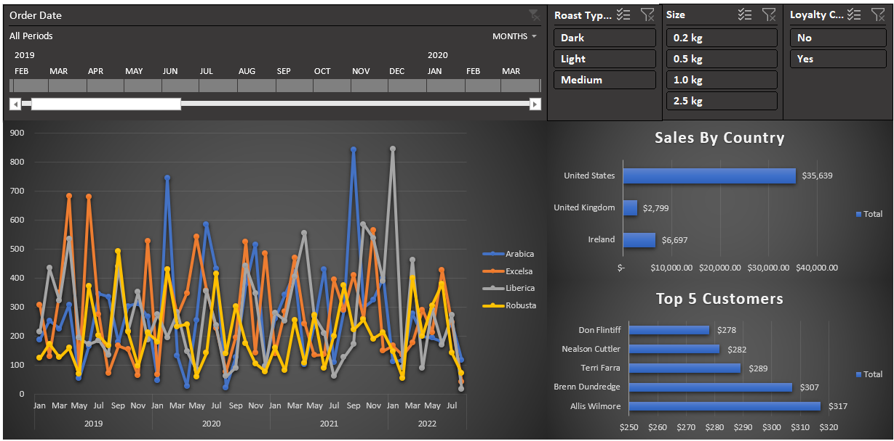

# ☕ Coffee Sales Dashboard — Excel

## Overview
An end-to-end interactive sales dashboard built in Excel, merging three disconnected datasets (Orders, Customers, Products) into a single dynamic report with slicers, a timeline, and pivot charts.



## Dataset

- **Orders** — 1,000 rows, 13 columns (Order ID, Date, Customer ID, Product ID, Quantity + blank columns to fill)
- **Customers** — 1,000 rows (Customer ID, Name, Email, Country, Loyalty Card etc.)
- **Products** — 48 rows (Product ID, Coffee Type, Roast Type, Size, Unit Price etc.)

## Step 1 — Data Gathering (ETL)

### Customer data via XLOOKUP
Pulled Customer Name, Email, and Country from the Customers sheet into the Orders sheet using `XLOOKUP` on Customer ID. The Email column was wrapped in `IFERROR` to return blank instead of 0 for missing values.
```excel
=XLOOKUP(C2, customers!$A:$A, customers!$B:$B)
=IFERROR(XLOOKUP(C2, customers!$A:$A, customers!$C:$C), "")
```

### Product data via INDEX/MATCH
Used a single draggable formula across the entire product block. Locking `$D2` (row match) and `I$1` (column match) independently means dragging right auto-fetches each product attribute without rewriting the formula.
```excel
=INDEX(products!$A:$G, MATCH($D2, products!$A:$A, 0), MATCH(I$1, products!$1:$1, 0))
```

### Abbreviation expansion via nested IF
Converted short codes into readable labels:
- **Coffee Type:** Ara &rarr; Arabica, Exc &rarr; Excelsa, Lib &rarr; Liberica, Rob &rarr; Robusta
- **Roast Type:** L &rarr; Light, M &rarr; Medium, D &rarr; Dark

### Sales column
```excel
=[Unit Price] * [Quantity]
```

## Step 2 — Formatting & Table Conversion
- **Order Date** &rarr; custom format `dd-mmm-yyyy`
- **Size** &rarr; custom format `0.0"kg"`
- **Unit Price & Sales** &rarr; Currency, `$#,##0` (no decimals)
- Converted full dataset to an Excel Table (`Ctrl+T`) named `ordersTable` for dynamic pivot updates

## Step 3 — Pivot Tables & Charts

| Pivot | Rows | Values | Chart Type |
|-------|------|--------|------------|
| **Sales Over Time** | Order Date (grouped by Month + Year) | Sum of Sales | Line Chart (series by Coffee Type) |
| **Sales by Country** | Country (sorted descending) | Sum of Sales | Bar Chart |
| **Top 5 Customers** | Customer Name (Value Filter &rarr; Top 5) | Sum of Sales | Bar Chart |

## Step 4 — Dashboard Assembly
1. Created a dedicated Dashboard sheet with dark background and gridlines hidden.
2. Cut and pasted all 3 charts onto the Dashboard sheet.
3. Added 3 **Slicers** — Roast Type, Size, Loyalty Card.
4. Added 1 **Timeline** — Order Date.
5. Connected all slicers and timeline to all 3 pivot tables via Report Connections so every filter updates the entire dashboard simultaneously.

## Key Excel Concepts Used
- **XLOOKUP** — simple column lookups with error handling
- **INDEX/MATCH** — 2D lookup with a single draggable formula using mixed cell references
- **IFERROR** — clean error handling instead of double-calculating with IF
- **Nested IF** — label expansion from abbreviations
- **Pivot Tables & Pivot Charts**
- **Slicers + Timeline** with Report Connections
- **Custom number formatting**
